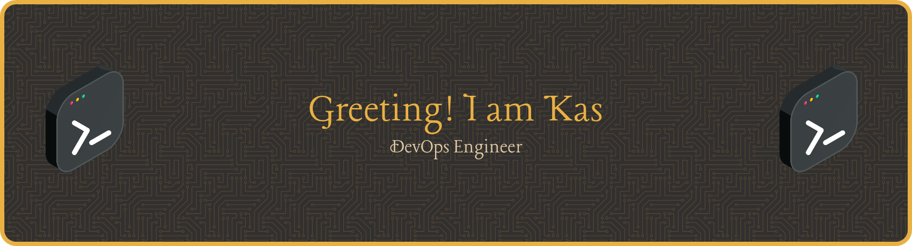

## About Me
- I’m a desktop support engineer transitioning to Devops.
- 4 Year Full Time Linux User (Desktop and Server)
- I regularly post articles to my [website](https://www.ksefuke-labs.com/)
- Hobbies: Playing indie games, listening to music and tinkering with my homelab

  

## Latest Blog posts
<!-- BLOG-POST-LIST:START -->
- [Kubectl Explain - Another Tool to add to your belt](https://www.ksefuke-labs.com/articles/kubectl-explain---another-tool-to-add-to-your-belt/)
- [Enterprise Grade Firewall Router](https://www.ksefuke-labs.com/articles/enterprise-grade-firewall-router/)
- [Cloudflare Tunnels &amp; K8s](https://www.ksefuke-labs.com/articles/cloudflare-tunnels--k8s/)
- [Encrypting Secrets with SOPs](https://www.ksefuke-labs.com/articles/encrypting-secrets-with-sops/)
- [Hugo Site Deployment](https://www.ksefuke-labs.com/articles/hugo-site-deployment/)
<!-- BLOG-POST-LIST:END -->

<!--
**ksefuke-labs/ksefuke-labs** is a ✨ _special_ ✨ repository because its `README.md` (this file) appears on your GitHub profile.

Here are some ideas to get you started:

- 🔭 I’m currently working on ...
- 🌱 I’m currently learning ...
- 👯 I’m looking to collaborate on ...
- 🤔 I’m looking for help with ...
- 💬 Ask me about ...
- 📫 How to reach me: ...
- 😄 Pronouns: ...
- ⚡ Fun fact: ...
-->
